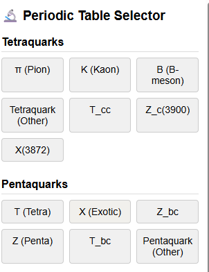
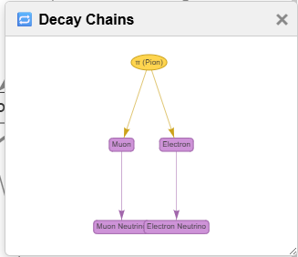
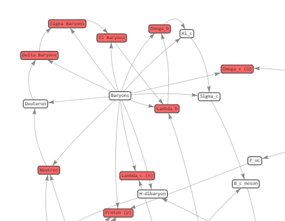

# 🧬 Interactive Quantum Particle Web

> A dynamic, interactive visualization of the **Standard Model**, including forces, particles, decay chains, and more — all in your browser.


---

## 🎯 What is this?

This is a **fully interactive knowledge map** of subatomic particles — built for students, enthusiasts, and educators — visualizing:

* 🔗 Particle interactions and force groupings
* ⚛️ Internal structure (quark composition)
* 💥 Decay paths
* 📊 Mass and lifetime overlays
* 🧠 Rich particle facts and info
* 🧪 Periodic-style particle selector
* 🔍 Vis.js powered network layout

---

## 🧩 Core Features

| Status    | Feature                 | UI Toggle                  |
| --------- | ----------------------- | -------------------------- |
| ✅ Done    | Internal Quark Viewer   | "🔍 View Structure"        |
| ✅ Done    | Force Interactions      | Force toggle buttons       |
| ✅ Done    | Mass/Lifetime Rankings  | Info panel sections        |
| ✅ Done    | Decay Chain Viewer      | "View Decay Chain"         |
| ✅ Done    | Lifetime Node Coloring  | 🕓 Lifetime View           |
| ✅ Done    | Mass-Based Node Scaling | ⚖️ Mass Layer              |
| ⏳ Pending | Gauge Group View        | 🔣 Show Gauge Group        |
| ⏳ Pending | Decay Chain Animation   | 🎬 Play Common Decay Paths |
| ⏳ Pending | Discovery Timeline      | 📅 Discovery View          |
| ⏳ Pending | Discovery Lab Overlay   | 🧪 Origin Map              |
| ⏳ Partial | GPT Search Copilot      | 💡 Ask Me Anything         |
| ⏳ Pending | Conservation Laws View  | ⚖️ Conservation Mode       |
| ⏳ Pending | Quiz Mode               | 🎓 Challenge Me            |

---

## 📚 Particle Types Covered

* **Leptons**: Electron, Muon, Tau, Neutrinos (νₑ, ν\_μ, ν\_τ)
* **Quarks**: Up, Down, Strange, Charm, Bottom, Top
* **Gauge Bosons**: Photon, Gluon, W⁺/W⁻, Z⁰
* **Higgs Boson**
* **Hadrons**: Pions, Kaons, Baryons, Mesons
* **Exotics**: X(3872), Tetraquarks, Dark Photon, etc.

---

## 🚧 Upcoming Additions

> These will expand the dimension of understanding beyond the Standard Model:

🔸 **Supersymmetry (SUSY)**
 • Sleptons, Squarks, Neutralinos, Gravitino

🔸 **Extra Dimensions / String Theory**
 • Kaluza-Klein towers, String excitations

🔸 **Neutrino Mass Eigenstates**
 • ν₁, ν₂, ν₃ (oscillation basis)

🔸 **Quantum Field Theory**
 • Visual operators: ψ, φ, Aμ
 • Feynman vertex diagrams

🔸 **Quantum States & Qubits**
 • |0⟩, |1⟩, |ψ⟩ superpositions
 • Bloch spheres & entanglement

---

## 🖼 Screenshots

| Periodic Table View | Decay Chains | Force Toggles |
|---------------------|--------------|---------------|
|  |  |  |

---

## ⚙️ Tech Stack

* **Frontend**: HTML, CSS, JavaScript
* **Graphing**: [vis.js](https://visjs.org/)
* **Icons/UI**: Custom SCSS, emojis
* **Data Format**: JSON-style mappings for particle info

---

## 🚀 Getting Started

```bash
git clone https://github.com/ANTHONY-OLEVESTER/SubParticles-Web.git
cd SubParticles-Web
open index.html  # or serve via VS Code Live Server
```
